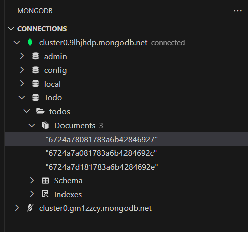

# ✅ Next.js Todo Application

[](https://nextjs.org/)
[](https://www.mongodb.com/)
[](https://tailwindcss.com/)

A modern, responsive Todo application built with Next.js 14, MongoDB, and TailwindCSS. Features real-time updates, client-side state management, and a clean user interface.

## ⭐ Key Features

- ✨ Clean and minimalist UI with TailwindCSS
- 🔄 Real-time state updates
- ⚡ Client-side form handling
- 🎯 CRUD operations (Create, Read, Update, Delete)
- 📱 Fully responsive design
- 🔍 Optimistic UI updates

## 🛠️ Tech Stack

- **Framework:** Next.js 14 with React Server Components
- **Database:** MongoDB
- **Styling:** TailwindCSS
- **State Management:** React useState & useEffect
- **API:** Next.js API Routes

## 💻 Code Structure

### TodoList Component
```jsx
'use client';
import { useState, useEffect } from 'react';
import TodoItem from './TodoItem';

export default function TodoList() {
  const [todos, setTodos] = useState([]);
  const [newTodo, setNewTodo] = useState('');

  // Fetch todos on component mount
  useEffect(() => {
    fetchTodos();
  }, []);

  // CRUD Operations
  const fetchTodos = async () => {
    const response = await fetch('/api/todos');
    const data = await response.json();
    setTodos(data);
  };

  const addTodo = async (e) => {
    e.preventDefault();
    if (!newTodo.trim()) return;
    
    const response = await fetch('/api/todos', {
      method: 'POST',
      headers: { 'Content-Type': 'application/json' },
      body: JSON.stringify({ text: newTodo }),
    });
    const todo = await response.json();
    setTodos([todo, ...todos]);
    setNewTodo('');
  };

  const toggleTodo = async (id, completed) => {
    const response = await fetch('/api/todos', {
      method: 'PUT',
      headers: { 'Content-Type': 'application/json' },
      body: JSON.stringify({ id, completed }),
    });
    const updatedTodo = await response.json();
    setTodos(todos.map((todo) => 
      todo._id === id ? updatedTodo : todo
    ));
  };

  const deleteTodo = async (id) => {
    await fetch('/api/todos', {
      method: 'DELETE',
      headers: { 'Content-Type': 'application/json' },
      body: JSON.stringify({ id }),
    });
    setTodos(todos.filter((todo) => todo._id !== id));
  };
}
```

## 📁 Project Structure

```
todo-app/
├── app/
│   ├── components/
│   │   ├── TodoList.js    # Main todo list component
│   │   └── TodoItem.js    # Individual todo item component
│   ├── api/
│   │   └── todos/
│   │       └── route.js   # API endpoint handlers
│   └── page.js            # Main page component
├── lib/
│   └── mongodb.js         # MongoDB connection
└── models/
    └── Todo.js            # Todo mongoose model
```

## 🚀 Getting Started

1. **Clone the repository:**
```bash
git clone https://github.com/arsath-eng/ToDo-next.js.git
cd todo-app
```

2. **Install dependencies:**
```bash
npm install
```

3. **Set up environment variables:**
Create a `.env.local` file:
```env
MONGODB_URI=your_mongodb_connection_string
```

4. **Run the development server:**
```bash
npm run dev
```

<p align="center">
  
</p>
<p align="center">
  
</p>
<p align="center">
  
</p>

## 🎯 API Endpoints

- `GET /api/todos` - Fetch all todos
- `POST /api/todos` - Create a new todo
- `PUT /api/todos` - Update a todo
- `DELETE /api/todos` - Delete a todo


## 🤝 Contributing

1. Fork the project
2. Create your feature branch (`git checkout -b feature/AmazingFeature`)
3. Commit your changes (`git commit -m 'Add some AmazingFeature'`)
4. Push to the branch (`git push origin feature/AmazingFeature`)
5. Open a Pull Request


⭐ If you found this project helpful, please give it a star!
